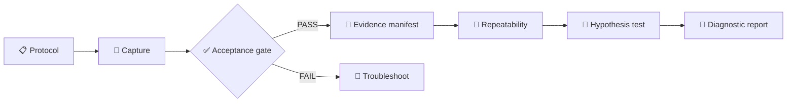

# SherloCAN Diagnostic Experiment Procedure

_Last verified in CI: pending branch gate · Scope: v0.2.1 software workflow · Hardware J2534 validation: NOT YET VERIFIED_

## 📋 Purpose

This procedure turns a capture into traceable diagnostic evidence. It does not identify ECU ownership, infer a Nissan CAN bitrate, or declare root cause.

## 📋 Prerequisites

| Requirement | Verify | Expected |
| --- | --- | --- |
| J2534 provider | SherloCAN Device Test | provider discovered |
| Bitrate | external verified source | explicit value; never guessed by SherloCAN |
| Capture mode | UI/API capability | application-read-only |
| Trial identity | Experiment Protocol | scenario + unique trial number |
| START marker | operator observation | timestamp inside RAW |

Do not continue to A/B interpretation when Capture Acceptance is FAIL.

## 🔧 Procedure

### Step 1: Complete Experiment Protocol

Record scenario (NORMAL_A / FAULT_B / WIGGLE / CONTROL), trial number, ignition state, engine state, provider index, confirmed bitrate and its source, capture limits, and battery voltage when measured.

**PASS:** required fields are present and bitrate source is explicit.  
**FAIL:** unknown/guessed bitrate, missing source, invalid trial or capture bounds.

### Step 2: Run bounded atomic capture

Use the existing Open → Connect → Capture → Disconnect → Close lifecycle. The application must not intentionally transmit diagnostic requests.

**Expected result:** a completed session with RAW evidence metadata.

### Step 3: Apply Capture Acceptance Gate

Required checks: Device Open, CAN Channel, Observed > 0, Dropped = 0 / no DATA LOSS, RAW path, SHA-256, clean Disconnect, clean Device Close, and transmit_performed=false.

**PASS** means technically usable capture evidence only. It does not mean the vehicle or network is healthy.  
**FAIL** means do not use the session for repeatability conclusions until the failure is resolved.

### Step 4: Save Evidence Manifest

The manifest binds session ID, protocol, RAW path, SHA-256, frame counts, lifecycle status and acceptance result. ECU ownership remains UNKNOWN and causality NOT_ESTABLISHED unless separate verified evidence exists.

### Step 5: Register START and repeat trials

Use unique numbered A and B trials. The repeatability engine counts a fault observation once per B trial and reports A-within-A instability separately. Sessions with DATA LOSS block repeatability.

### Step 6: Review timing statistics

For each observed CAN ID, inspect sample count, median period, MAD and IQR. These are descriptive statistics, not proof of a faulty ECU.

### Step 7: Evaluate hypotheses

Each hypothesis shows Evidence For, Evidence Against, Unknown and Next Test. Repeated CAN divergence alone is INCONCLUSIVE. SUPPORTED or CONTRADICTED requires explicit direct-test evidence. There is no automatic CONFIRMED state.

## ✅ Verify it works

A software release is eligible only when frontend typecheck/build, backend compile and backend tests pass in CI. Hardware readiness is a separate gate and remains NOT VERIFIED until tested with the real OpenPort/J2534 stack and recorded evidence.

## 🔧 Troubleshooting

If Observed = 0, successful Connect is not enough: verify the selected provider, channel setup and externally confirmed bitrate. If DATA LOSS is reported, reduce load or fix the capture pipeline before analysis. If a START marker is missing, add the operator-observed marker; SherloCAN must not guess it from an unknown CAN ID. If hypothesis status seems too strong, inspect whether explicit direct evidence exists; observational divergence alone must remain INCONCLUSIVE.

## 🚀 Next

After CI is green, perform the first controlled hardware validation and retain the resulting manifest plus RAW hash as the verification record.
